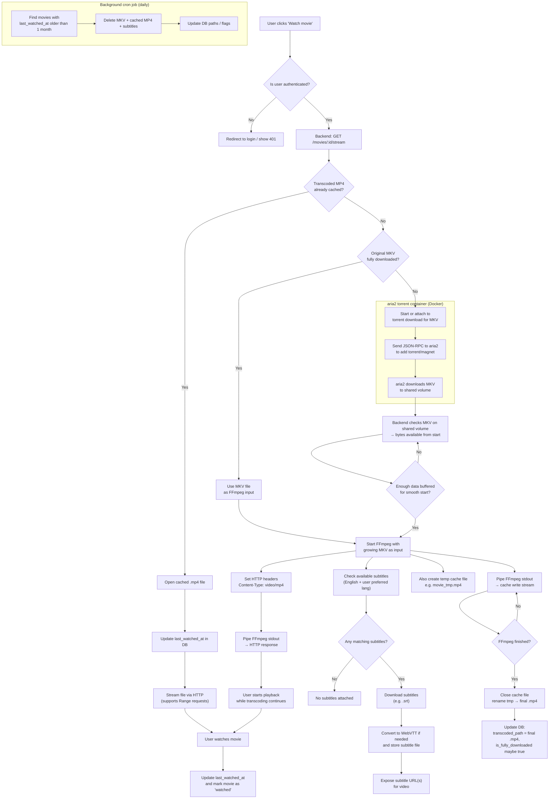

# HyperTube Streaming Flow Architecture

## Current Implementation Status

### ✅ Already Implemented
- User authentication (JWT)
- Movie entity with status tracking
- HLS transcoding (480p, 720p, 1080p, etc.)
- aria2 download integration
- Watch history tracking
- Redis status updates
- Subtitles entity and basic service
- Cron job infrastructure (via @nestjs/schedule)

### ❌ Not Yet Implemented (TODO)
See TODO list below for details.

## Architecture Notes

### Current Approach
- Uses HLS (HTTP Live Streaming) with adaptive bitrate
- Transcodes to multiple quality levels in parallel
- Stores segments (.ts files) and playlists (.m3u8)
- Frontend uses HLS.js for playback

### Proposed Flow (from diagram)
- Direct MP4 streaming with progressive download
- Transcodes on-demand during first watch
- Caches transcoded MP4 for subsequent views
- FFmpeg piped directly to HTTP response

### Recommendation
Consider hybrid approach:
1. Keep HLS for better adaptive streaming
2. Add progressive MP4 caching for completed transcodes
3. Implement on-demand transcoding as fallback
4. Add subtitle integration to HLS workflow
